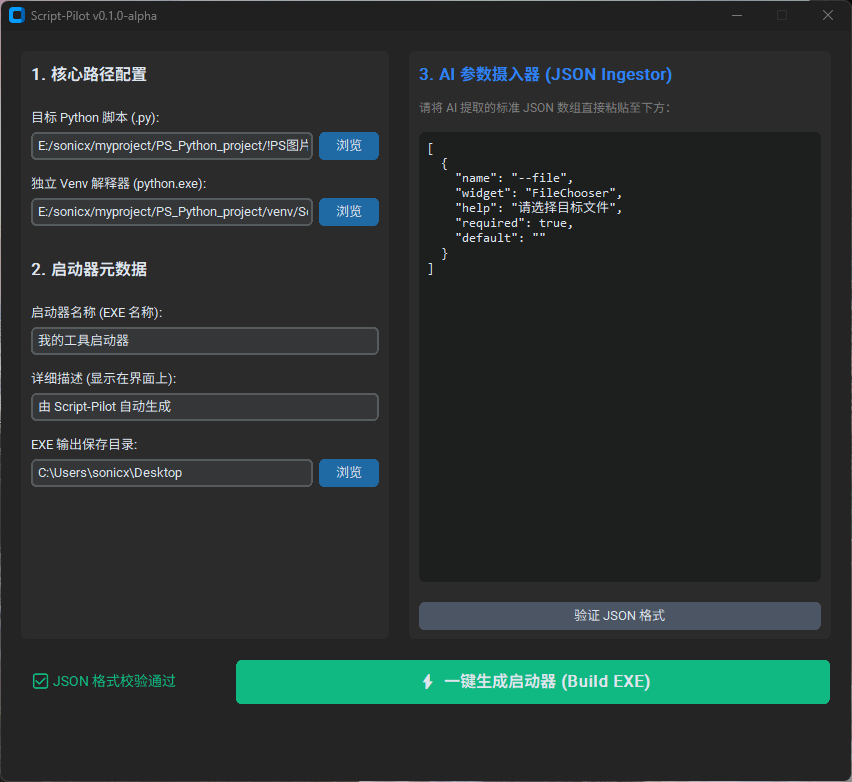

 ## Script-Pilot 🚀

 

[](https://opensource.org/licenses/MIT)
[](https://www.python.org/)
[](https://github.com/TomSchimansky/CustomTkinter)

> **Stop bundling 100MB EXEs. Turn any Python script into a 2MB lightweight GUI launcher in seconds.**
> 
> 专为 AI 辅助编程时代设计的“零代码 Python 瘦壳启动器生成引擎”。

## 💡 为什么开发 Script-Pilot？ (The Problem)

在 AI 辅助编程（如 Cursor / Trae）普及的今天，编写底层 Python 逻辑变得极其简单，但**“脚本的本地化部署与交互”**却成为了新的瓶颈：
1. **AI 界面困境:** 让 AI 直接写 Tkinter/PyQt 代码极易导致线程卡死，排查困难。
2. **胖客户端臃肿:** 使用 `auto-py-to-exe` 打包一个几十 KB 的脚本，会生成 100MB+ 的庞然大物，且每次修改底层代码都需要重新耗时编译。
3. **终端恐惧症:** 每次运行都需要激活虚拟环境、手敲命令行参数，反人类且易错。

## 🎯 解决方案：瘦壳代理架构 (Thin-Shell Architecture)

Script-Pilot 彻底解耦了“前端 UI”与“后端逻辑”。
它**不打包**你的 Python 环境和业务代码，而是生成一个极轻量的“GUI 遥控器”。

- ⚡ **极速秒开:** 生成的 `.exe` 启动器仅有 ~2MB 大小。
- 🔄 **零编译热更新:** 修改底层 `.py` 源码后直接保存，下次双击启动器即刻生效，**永远无需重新打包**。
- 🛡️ **绝对隔离:** 原生支持绑定独立的 Virtual Environment (虚拟环境) 绝对路径，彻底告别依赖地狱。
- 🤖 **AI Native:** 独创“JSON 参数摄入器”，完美闭环 AI 编程工作流。

---

## 🛠️ 快速开始 (Quick Start)

### 1. 环境准备
确保您的系统已安装 Python 3.8+，并安装核心依赖：
```bash
pip install customtkinter gooey pyinstaller
```

### 2. 启动 Script-Pilot
克隆本仓库并运行主程序：
```bash
git clone https://github.com/YourUsername/Script-Pilot.git
cd Script-Pilot
python main.py
```

### 3. 三步生成启动器
1. **配置路径:** 在界面左侧填入目标脚本 (`.py`) 及其专属虚拟环境 (`python.exe`) 的绝对路径。
2. **粘贴 JSON:** 在右侧窗口粘贴由 AI 生成的参数表单 JSON（见下方说明）。
3. **一键 Build:** 点击生成，桌面上将瞬间出现一个带有现代表单界面的独立 `.exe`。

---

## 💎 核心玩法：AI 提示词驱动流 (Prompt-Driven Workflow)

Script-Pilot 最强大的地方在于它与 AI 的完美配合。在编写脚本时，请直接将以下 Prompt 喂给你的 AI（如 ChatGPT / Claude）：

### 让 AI 帮你提取标准 JSON 参数
当你写好了一个使用 `argparse` 接收参数的脚本后，发送以下提示词：

> "分析我提供的这段 Python 代码。提取出它所需要的所有外部输入参数。
> 请将这些参数转换为以下标准的 JSON 数组格式输出，不要输出任何其他废话：
> `[{"name": "参数名(如--file)", "widget": "控件类型(TextField/FileChooser/DirChooser/Dropdown)", "help": "中文说明", "required": true/false, "default": "默认值"}]`
> **控件类型选择指南：** 如果是文件路径选 FileChooser，文件夹路径选 DirChooser，有限选项选 Dropdown，其余选 TextField。"

拿到 AI 吐出的 JSON 后，直接 `Ctrl+V` 粘贴进 Script-Pilot 的右侧窗口，你的 GUI 表单就瞬间设计完成了！

---

## 🏗️ 架构说明 (Architecture)

Script-Pilot 的底层工作流：
1. **UI 层:** `CustomTkinter` 收集路径与 JSON 数组。
2. **生成层:** `code_generator.py` 动态构建一段基于 `Gooey` 的代理源码 (`proxy.py`)。这段源码包含了完整的 UI 控件映射，并在底层使用 `subprocess.Popen` 调用目标环境。
3. **编译层:** `build_engine.py` 在后台静默调用 `PyInstaller -F -w`，将 `proxy.py` 瞬间编译为轻量级独立可执行文件。

## 📜 许可证 (License)
本项目采用 [MIT License](LICENSE) 开源协议。欢迎 Fork 与 PR！
